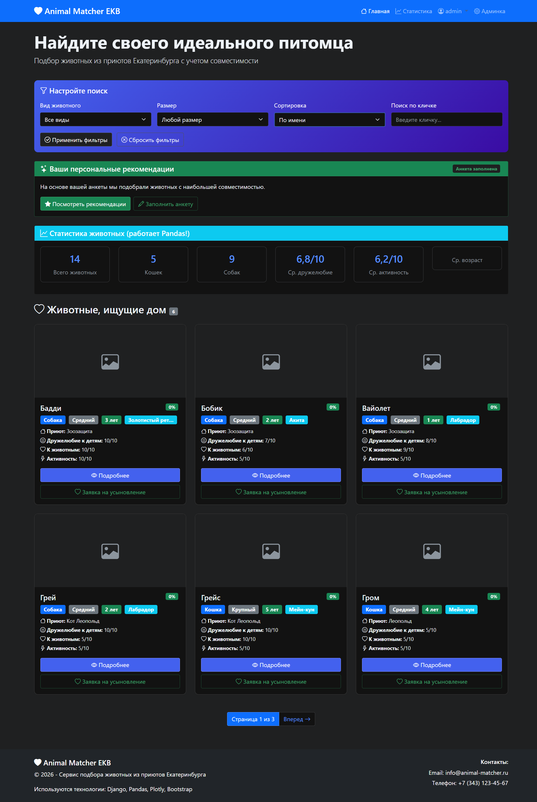
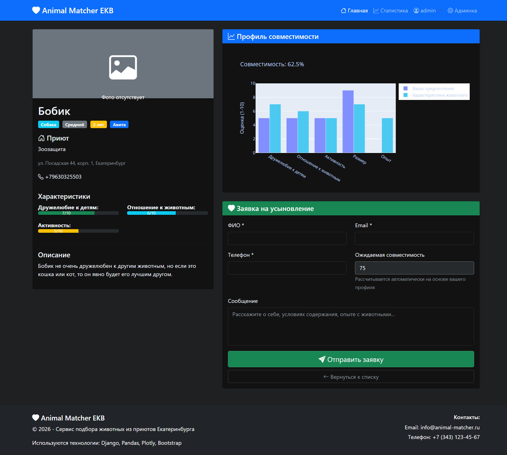
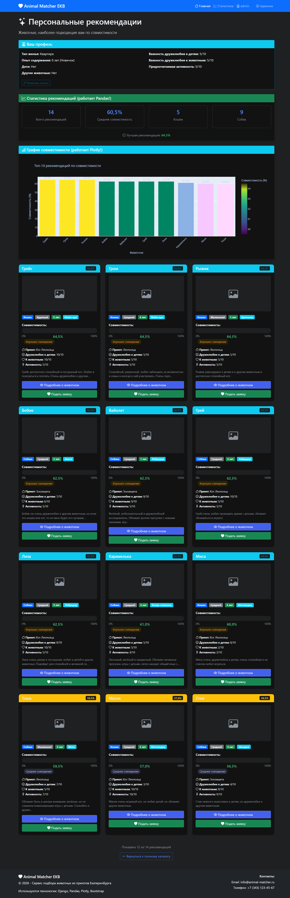
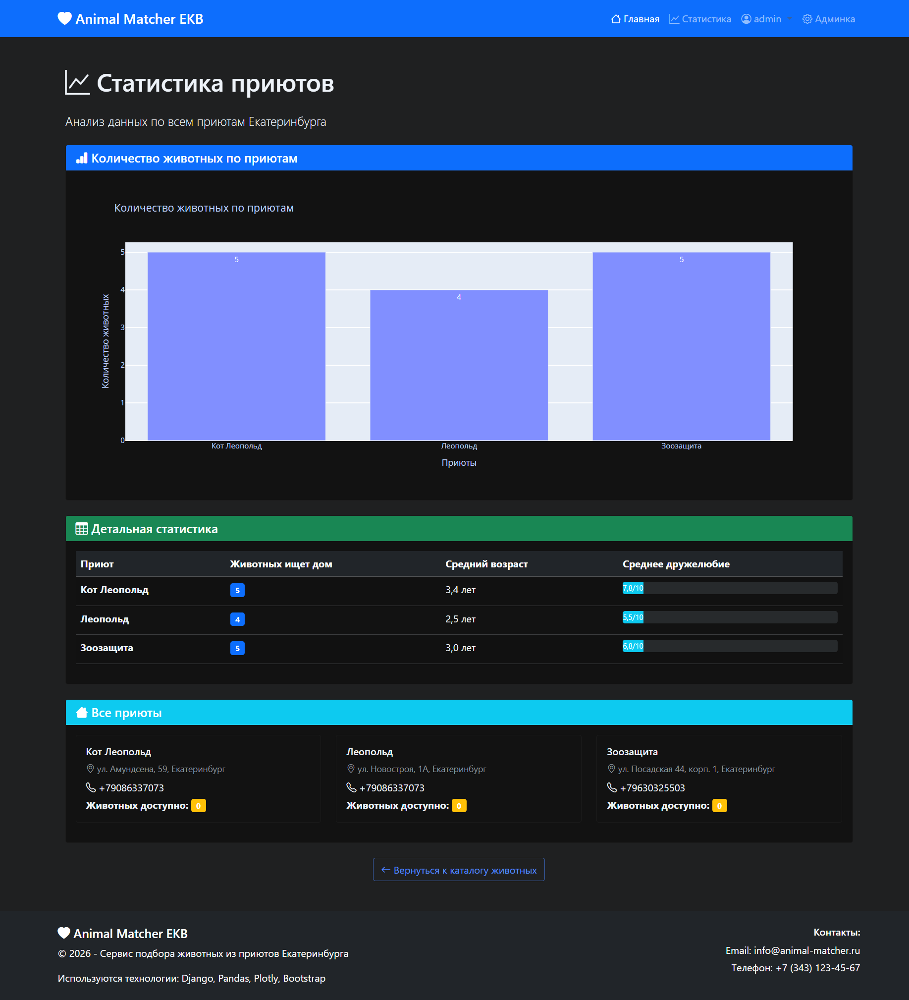

# Animal Matcher EKB 

**Веб-сервис для интеллектуального подбора животных из приютов Екатеринбурга с алгоритмом расчета совместимости**

Сервис анализирует десятки параметров животного и условий содержания пользователя, предоставляя обоснованные
рекомендации. Решает проблему необдуманных усыновлений и последующих возвратов животных в приюты, 
повышая процент успешных адаптаций питомцев.

**Демо-версия:** [https://dusanovaalina.pythonanywhere.com](https://dusanovaalina.pythonanywhere.com)

## Стек технологий

**Backend:** Python 3.13, Django 6.0  
**Database:** SQLite  
**Analytics:** Pandas (расчет совместимости), Plotly (интерактивные графики)  
**Frontend:** Bootstrap 5, Bootstrap Icons  
**Utils:** Pillow (изображения), python-dotenv (настройки)

## Интерфейс

### 1. Главная страница с каталогом животных


### 2. Карточка животного с графиком совместимости


### 3. Персональные рекомендации


### 4. Статистика приютов


## Как запустить проект локально

### 1. Клонируйте репозиторий:
```bash
git clone https://github.com/ваш-username/animal-matcher-ekb.git
cd animal-matcher-ekb
```

### 2. Создайте и активируйте виртуальное окружение:
```bash
python -m venv venv
source venv/bin/activate  # для Linux/Mac
# или
venv\Scripts\activate     # для Windows
```

### 3. Установите зависимости:
```bash
pip install -r requirements.txt
```

### 4. Настройте переменные окружения:
Создайте файл `.env` в корне проекта:
```env
SECRET_KEY=ваш-секретный-ключ
DEBUG=True
ALLOWED_HOSTS=localhost,127.0.0.1
```

### 5. Выполните миграции:
```bash
python manage.py migrate
```

### 6. Создайте суперпользователя:
```bash
python manage.py createsuperuser
```

### 7. Запустите сервер:
```bash
python manage.py runserver 8081
```

### 8. Откройте проект в браузере:
Перейдите по ссылке: [http://127.0.0.1:8081/](http://127.0.0.1:8081/)
